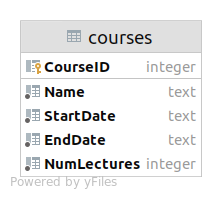

# YPS

## License notice

_EXCLUSIVE COPYRIGHT IS OWNED BY STANISLAV AKIMOV (THE AUTHOR).  
THE AUTHOR IS PROVIDING PERMISSION FOR CHECKING (IN ANY POSSIBLE MANNER) MATERIALS IN THIS REPOSITORY TO YALANTIS PYTHON
SCHOOL CURATORS AS A FIRST PART OF REQUIRED TEST TASK DURING SELECTING CANDIDATES TO THE SCHOOL.  
NO OTHER LICENSE IS OFFERING._
___

## What is it?

Part 1 of the [test task](https://docs.google.com/document/d/1QEZeDxCKnXcJu0EKPm9CuHQgN_hkZCOI2iJl1mq3Y50) for Yalantis
Python School.
___

## How to start the application?

To be able to run the application you need to do the following steps (UNIX version):

1. Clone the repository and move to the created folder:

```shell 
$ git clone https://github.com/akimovstv/YPS.git
$ cd YPS
```

2. Create Python virtual environment and activate it.  
   (You need Python version 3.6 or greater)

```shell
$ python3 -m venv .venv
$ source .venv/bin/activate
```

3. Install requirements:

```shell
$ pip install -r requirements.txt
```

4. Run flask:

``` shell
$ env FLASK_APP=app.py FLASK_ENV=development flask run
```

(You might need to add this additional `--port <number_different_from_5000>` option to the last command, if you have
error `Address already in use`)

That is it. The application should be running on http://127.0.0.1:5000/ (or similar).
___

## How to test?

To test the application send http requests with your favorite tool to `http://127.0.0.1:5000/<endpoint>` and see what you
got as responses.

Also notice that after you send the first request, the sqlite database `data.db` will be created in the current folder.
You might also want to connect to it with your favorite tool and see what happens after each of your request.
___

## Database

The database is a single table like this:  

___

## Available endpoints:

| method | endpoint               | URL paramenters                                                                                                | JSON (body) data                                                                                         | Description                                                                                                                                           |
| ------ | ---------------------- | -------------------------------------------------------------------------------------------------------------- | -------------------------------------------------------------------------------------------------------- | ----------------------------------------------------------------------------------------------------------------------------------------------------- |
| GET    | `/catalogue`           |                                                                                                                |                                                                                                          | Return all courses                                                                                                                                    |
| GET    | `/catalogue`           | `?course-name=<course_name>`                                                                                   |                                                                                                          | Return all courses with the name `<course_name>`                                                                                                      |
| GET    | `/catalogue`           | `?start-date-after=<start_date_after>`                                                                         |                                                                                                          | Return all courses that start after or exactly on `<start_date_after>`                                                                                |
| GET    | `/catalogue`           | `?end-date-before=<end_date_before>`                                                                           |                                                                                                          | Return all courses that end before or exactly on `<end_date_before>`                                                                                  |
| GET    | `/catalogue`           | `?course-name=<course_name>`<br>`&start-date-after=<start_date_after>`                                         |                                                                                                          | Return all courses with the name `<course_name>` that start after or exactly on `<start_date_after>`                                                  |
| GET    | `/catalogue`           | `?course-name=<course_name>`<br>`&end-date-before=<end_date_before>`                                           |                                                                                                          | Return all courses with the name `<course_name>` that end before or exactly on `<end_date_before>`                                                    |
| GET    | `/catalogue`           | `?start-date-after=<start_date_after>`<br>`&end-date-before=<end_date_before>`                                 |                                                                                                          | Return all courses that start after or exactly on `<start_date_after>` and end before or exactly on `<end_date_before>`                               |
| GET    | `/catalogue`           | `?course-name=<course_name>`<br>`&start-date-after=<start_date_after>`<br>`&end-date-before=<end_date_before>` |                                                                                                          | Return all courses with the name `<course_name>` that start after or exactly on `<start_date_after>` and end before or exactly on `<end_date_before>` |
| POST   | `/course`              |                                                                                                                | `"name": <name>,`<br>`"start": <start_date>,`<br>`"end": <end_date>,`<br>`"lectures": <number_lectures>` | Insert the course with `<name>`, `<start_date>`, `<end_date>` and `<number_lectures>` to database and return created order. All fields are required.  |
| GET    | `/course/<course_id>`  |                                                                                                                |                                                                                                          | Return all information about the course with id `<course_id>` from database                                                                           |
| PATCH  | `/course/<course_id>`  |                                                                                                                | `"name": <name>,`<br>`"start": <start_date>`,<br>`"end": <end_date>,`<br>`"lectures": <number_lectures>` | Update the course with id `<course_id>` with optional fields `<name>`, `<start_date>`, `<end_date>` and `<number_lectures>` in database               |
| DELETE | `/course/<course_id>`  |                                                                                                                |                                                                                                          | Delete the course with id `<course_id>` from database                                                                                                 |


You might also like to use provided Postman Api [collection](assests/YPS.postman_collection.json).
___

## Notes

This is my first time in life creating endpoints and working with FLASK. So, the codebase might be raw and definitely
not a production level. Over the past several days I have been reading and watching about proper API creation. Some
examples of what I read and watched:

- MDN Server-Side programming and HTTP documentation
- Several sections of video course "REST APIs with Flask and Python" by Jose Salvatierra Fuentes
- Flask documentation
- Flask-RESTful documentation
- Materials about API creation on https://realpython.com/
- SQLite documentation etc., etc.

I used Flask-RESTful and pure Python sqlite3 interface (without ORM).

I can see some inaccuracies. For example, my application not always return JSON response (it returns HTML response in
cases, where there are resource not found, etc.)

But overall I am satisfied with myself, and the work I have done. 